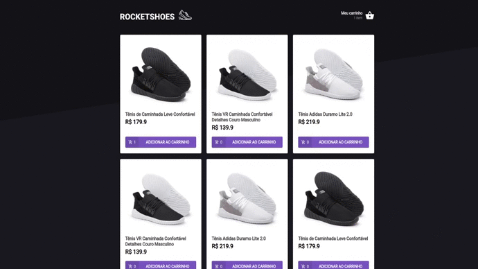

# RocketShoes

 * Desafio feito pela rocktseat. A ideia é desenvolver uma loja de tenis com intuito de adicionar produtos ao carrinho.

 

# 🖥 Tecnologias utilizadas no projeto

 ✅ ReactJs

 ✅ Json Server - Fake Api

 ✅ Styled components | Polished | Toast - Estilização

 

# 🧑‍💻 Densenvolvimento das telas

✔ Pagina Inicial de produtos

✔ Tela do carrinho de produtos

 

# Instalação

~~~html
# Copie e cole no seu terminal 

$ git clone https://github.com/OttoSouza/ignite_cart_store_chapter_II
~~~

~~~html
# Acesse a pasta
$ cd ignite_cart_store_chapter_II

# Execute os seguintes comandos
$ yarn start - Iniciar a aplicação
$ yarn server - Iniciar a fake api.

# Acessa pelo  browser 
$ https://localhost:3000
~~~

 

